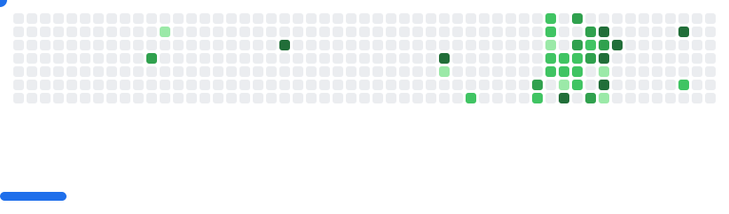

## Hey I'm Lakhan 👋


```json
{
  "job": "CS Undergrad 2027",
  "birthday": "02-10-2005",
  "country": "India",
  "city": "Jaipur",
  "interest": ["Tech", "Running", "Basketball", "..."]
}
```

<!--
For more details on me: [Portfolio](website link)
-->

</br>

## 🌐 Connect with Me

[](https://www.linkedin.com/in/lakhan-gurjar/)
[](https://github.com/Lakhan-Gurjar)
[](https://leetcode.com/u/lakhangurjar831/)
[](mailto:lakhangurjar831@gmail.com)

</br>

## 🔨 Languages and Frameworks

     
   <!-- Currently Learning
 -->  

  <!-- Will learn later
  -->

</br>

## 👨🏻‍💻 Tools and Editors

   <!-- Will learn soon   --> 
  
<!--  -->

</br>

## ✍️ Quote
<p align="center">

</p>

<details open align="center">
  <summary>📈 More Stats</summary>
  <br>

<p align="center">
<div align="center">
 <a href="https://github.com/Lakhan-Gurjar"> 
 </br></br>


</br></br>
 </a>

  </br> </br>
 [](https://github.com/Lakhan-Gurjar) </br></br>
[](https://github.com/Lakhan-Gurjar) </br>

<p align="center">
  
</p>

</div> 
</details>

<picture>
  <source media="(prefers-color-scheme: dark)"  srcset="images/breakout-dark.svg" />
  <source media="(prefers-color-scheme: light)" srcset="images/breakout-light.svg" />
  
</picture>
